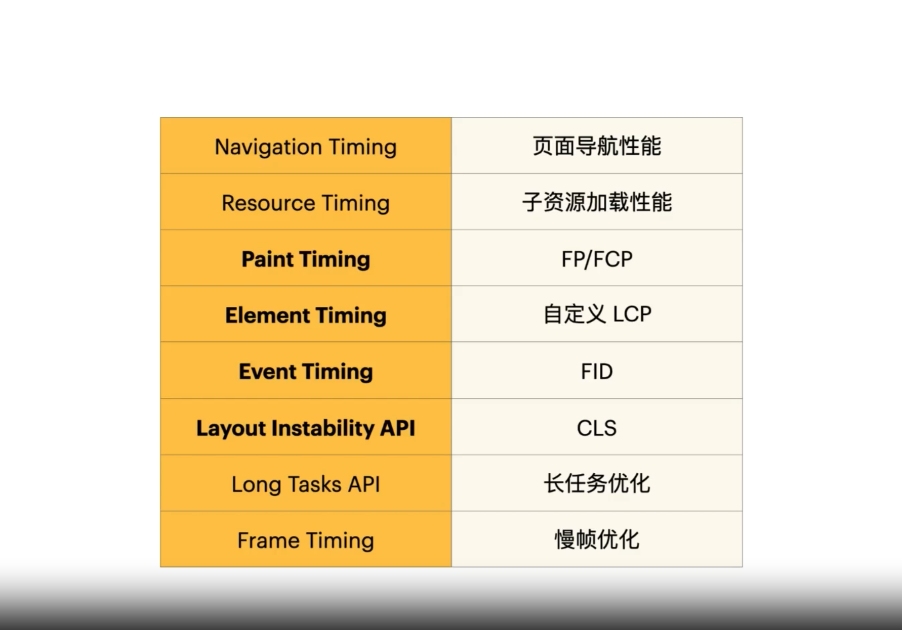

 #  web性能标准
> https://www.zaozao.run/video/c18/c18-1 总结
 ## 历史发展
 

 ## RAIL模型
 
 

 ## Performance Timeline

## 最长需要关注的优化信息

### FCP
- 首次内容绘制时间 First contentful paint

### LCP
- 最大内容绘制时间 Largest contentful paint

### FID 
- 首次输入延迟 First input delay

## TTI
- 页面可交互时间 Time to Interactive

## TBT 
- 主线程累计阻塞时间 Total blocking time

## CLS
- 累计布局偏移 Cumulative layout shift

# 如何做性能优化

## 性能指什么

## 常用优化手段

- 缓存技术

- 预加载

- 渲染方案

