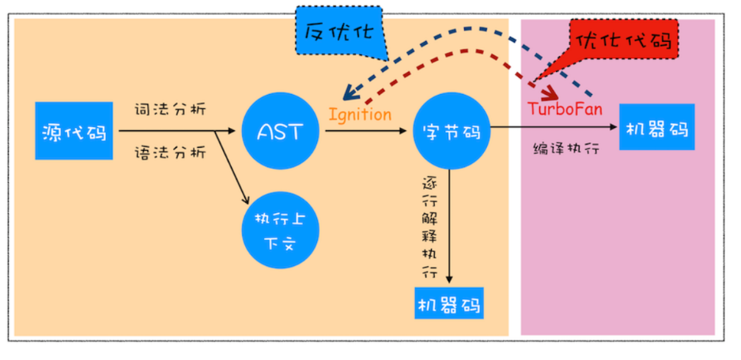
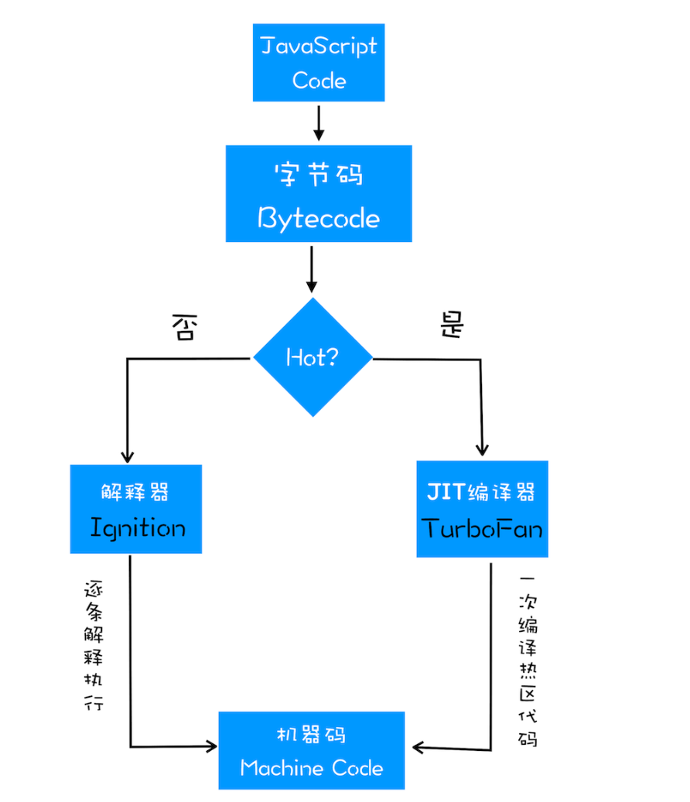

 ## V8 的工作原理， 
 
 - 编译器（Compiler）
 - 解析器（Interpreter）
 - 抽象语法树（AST）
 - 字节码（Bytecode）
 - 即时编译器（JIT）等概念， 

## V8是如何执行一段JavaScript代码的

执行代码
生成字节码之后，接下来就要进入执行阶段了。

通常，如果有一段第一次执行的字节码，解释器 Ignition 会逐条解释执行。在执行字节码的过程中，如果发现有热点代码（HotSpot），比如一段代码被重复执行多次，这种就称为热点代码，那么后台的编译器 TurboFan 就会把该段热点的字节码编译为高效的机器码，然后当再次执行这段被优化的代码时，只需要执行编译后的机器码就可以了，这样就大大提升了代码的执行效率。

V8 的解释器和编译器的取名也很有意思。解释器 Ignition 是点火器的意思，编译器 TurboFan 是涡轮增压的意思，寓意着代码启动时通过点火器慢慢发动，一旦启动，涡轮增压介入，其执行效率随着执行时间越来越高效率，因为热点代码都被编译器 TurboFan 转换成了机器码，直接执行机器码就省去了字节码“翻译”为机器码的过程。

其实字节码配合解释器和编译器是最近一段时间很火的技术，比如 Java 和 Python 的虚拟机也都是基于这种技术实现的，我们把这种技术称为即时编译（JIT）。具体到 V8，就是指解释器 Ignition 在解释执行字节码的同时，收集代码信息，当它发现某一部分代码变热了之后，TurboFan 编译器便闪亮登场，把热点的字节码转换为机器码，并把转换后的机器码保存起来，以备下次使用。

对于 JavaScript 工作引擎，除了 V8 使用了 字节码+JIT 技术之外，苹果的 SquirrelFish Extreme 和 Mozilla 的 SpiderMonkey 也都使用了该技术。

这么多语言的工作引擎都使用了 字节码+JIT 技术，因此理解 JIT 这套工作机制还是很有必要的。你可以结合下图看看 JIT 的工作过程：

## 参考
https://github.com/cnAlexJiang/BrowserPrinciple/blob/main/V8%E5%B7%A5%E4%BD%9C%E5%8E%9F%E7%90%86/%E7%BC%96%E8%AF%91%E5%99%A8%E5%92%8C%E8%A7%A3%E6%9E%90%E5%99%A8%EF%BC%9AV8%E5%A6%82%E4%BD%95%E6%89%A7%E8%A1%8C%E4%B8%80%E6%AE%B5JavaScript%E4%BB%A3%E7%A0%81%E7%9A%84/index.md