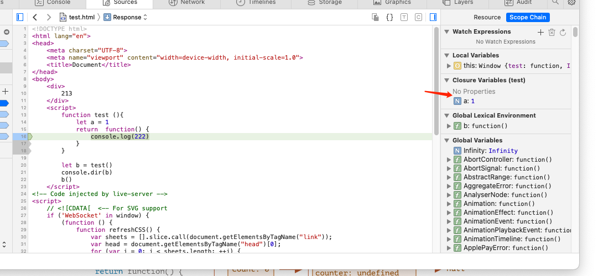

## 闭包 定义

闭包 是指一个函数可以记住其外部变量并可以访问这些变量。

也就是说：JavaScript 中的函数会自动通过隐藏的 [[Environment]] 属性记住创建它们的位置，所以它们都可以访问外部变量。

## 例子


```
     function test (){
            let a = 1
            return  function() {
                console.log(222)
            } 
        }

        let b = test()
        b()   
    // 未引用a，是否产生闭包？
```

- chrome 和 safari 调试堆栈的时候 显示不一样


- 原因是 chrome 做了优化


## 闭包例外
- new Function
```

function getFunc() {
  let value = "test";

  let func = new Function('alert(value)');

  return func;
}

getFunc()(); // error: value is not defined
如果我们使用 new Function 创建一个函数，那么该函数的 [[Environment]] 并不指向当前的词法环境，而是指向全局环境。
因此，此类函数无法访问外部（outer）变量，只能访问全局变量。

```

## 参考

- 现代js教程 https://zh.javascript.info/closure#step-2-han-shu-sheng-ming

- 语言 规范  https://tc39.es/ecma262/#sec-intro