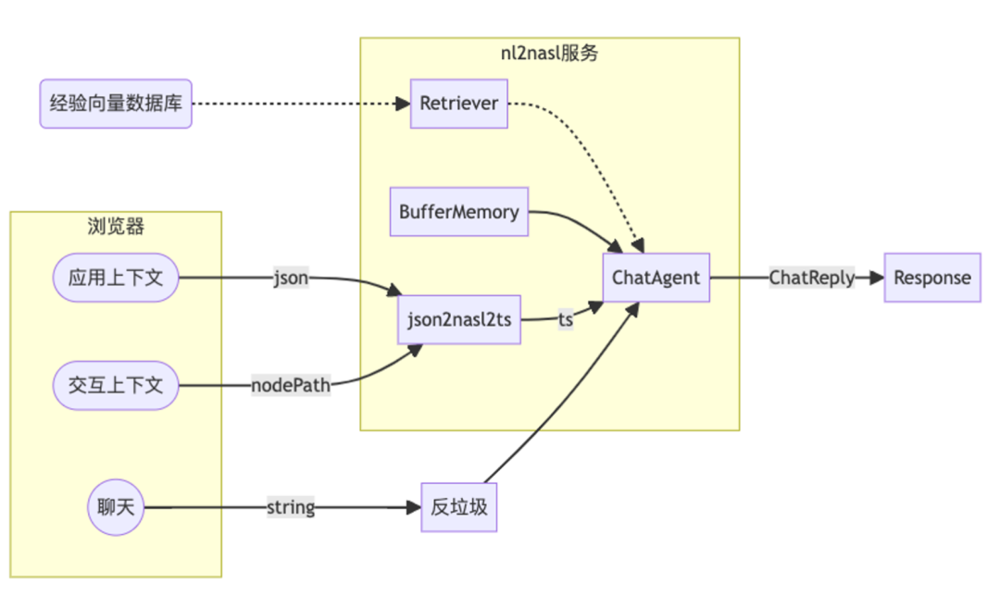
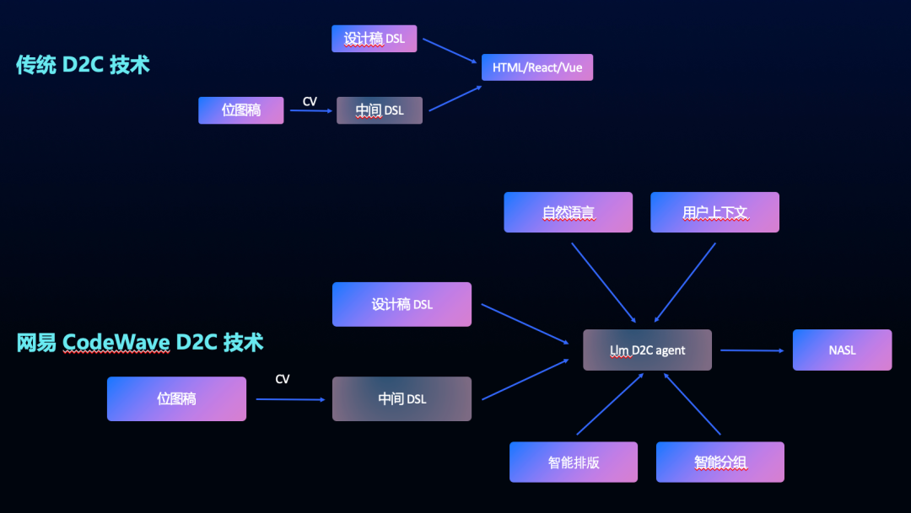

## ai应用场景相关  

- [] 使用 LangChain实 现 客 户 服 务 自 动 化
  - [] https://mp.weixin.qq.com/s/rxvfQDb5iX8flrdQAl4-BA
- 使用langchain实现web前端智能增强引导
  https://juejin.cn/post/7327467832866193434

  
## d2c相关 
### 一些调研
- [] https://semi.design/code/zh-CN/start/introduction
- [] https://juejin.cn/post/7281948788482637836

### 原理

### 自己的尝试

- [] 打造不被ai替代的 低代码平台 https://mp.weixin.qq.com/s/8dvY10W1CWYWBUm0uzd02Q
 - 
 - 