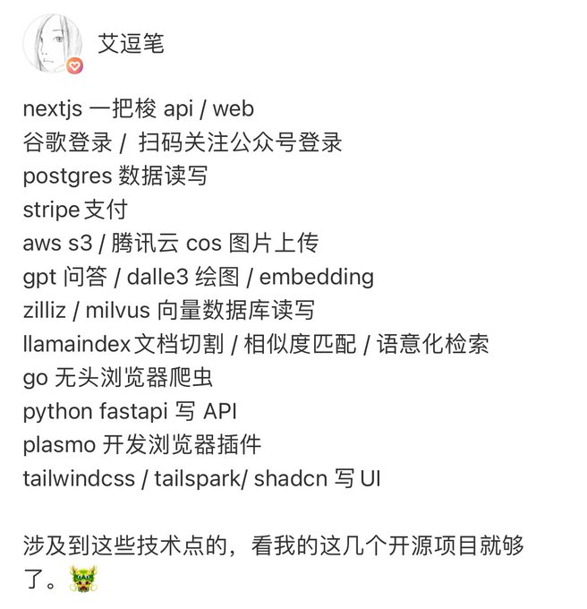
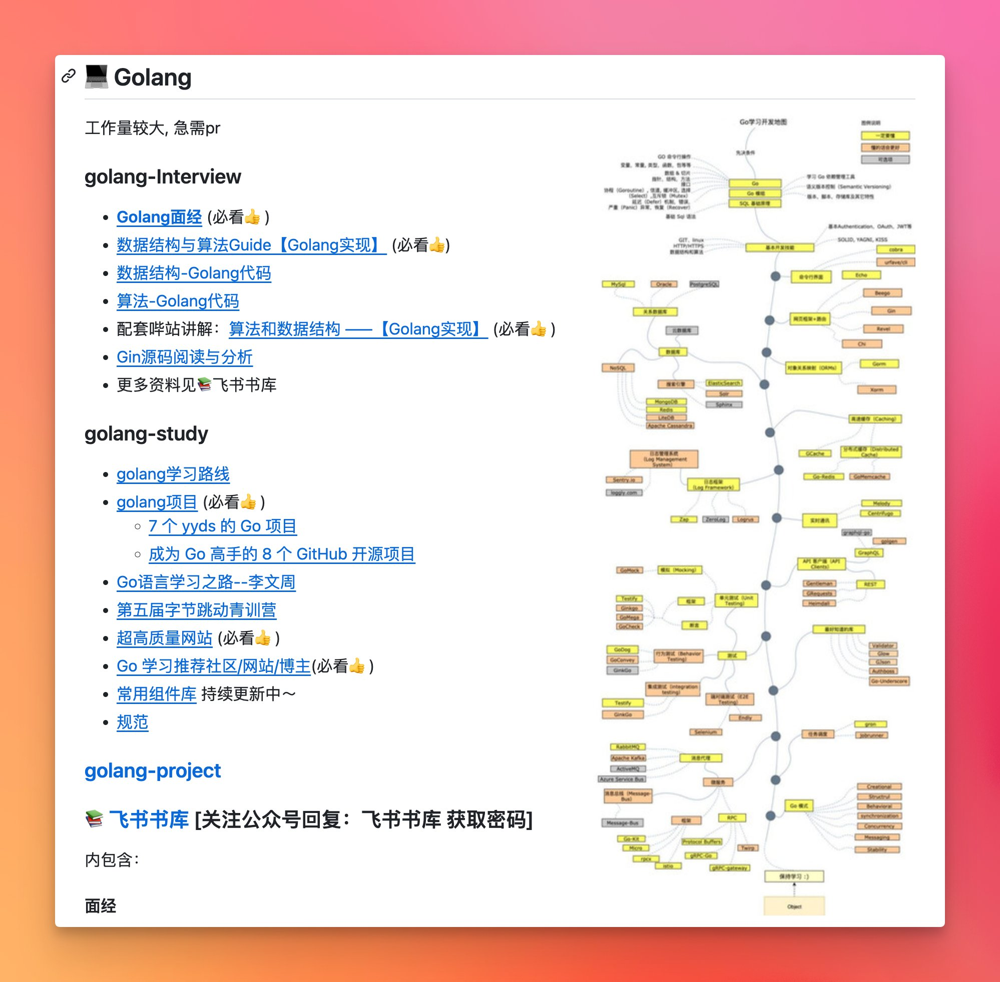

## 会用

### threejs
- [] https://juejin.cn/user/3491704660043197/posts

### nest + orm + db
  - orm  
    - typeorm
    - prisma
  - db
    - mysql
    - mongodb
    - redis
    - sqlite
    - postgresql
  - [] https://juejin.cn/post/7304959484827697163
  - nest like
    - https://hono.dev/
### SSR
  - [] next
    
  - [] nuxt
### docker 
  - [] 
### vercel

## agi

## golang
  https://twitter.com/geekbb/status/1766682643431567429/photo/1
https://github.com/mao888/golang-guide

## python

## desktop
  - [] electron
  - [] tauri